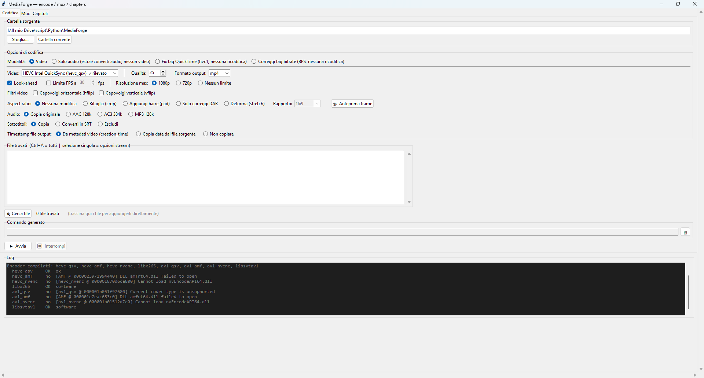

# MediaForge

Cross-platform (Windows/macOS/Linux) video toolkit — encode to HEVC/AV1 with automatic
hardware-encoder detection (Intel QuickSync, AMD AMF, NVIDIA NVENC, Apple VideoToolbox, or
software libx265/libsvtav1), mux tracks, and edit chapters. Built around fine per-file control
(stream selection, trim, real bitrate, track titles, tag fixes) for files that differ from one
another, rather than around batch processing — encoding can also run across a whole folder at
once, which is mainly useful when the source files are similar (e.g. clips from the same phone
or camcorder sharing the same settings).

**Why HEVC/AV1**: these are the two codec families actually worth targeting today. HEVC is the
most advanced codec with genuinely wide playback compatibility (hardware decode on essentially
every modern TV, phone, and media player); AV1 compresses better still, but needs dedicated
encode/decode hardware to be practical and is supported by fewer players — worth it when you
control the playback side, not a safe default otherwise.



## Features

- **Encode**: HEVC or AV1, with smart scaling capped at 1080p, aspect ratio/FPS/flip filters,
  per-stream selection (video/audio/subtitles), trim, and a live command preview — for one file
  with its own settings, or a whole folder of similar files at once
- Available encoders are detected automatically at startup by actually probing ffmpeg on the
  current machine (not just checking what it was compiled with), so the app proposes the right
  one per machine (AMF on AMD, QSV on Intel, VideoToolbox on Apple Silicon…)
- Exact real video bitrate (from packet sizes, not an estimate) and two maintenance tools: fix
  the HEVC tag some players need for HEVC-in-MP4, and fix a stale/wrong bitrate tag
- Audio-only mode for extracting/transcoding just the audio track
- **Mux**: combine or replace tracks across files without re-encoding, add external audio/
  subtitle tracks, edit track titles, extract a single track back out to its own file
- **Chapters**: edit a chapter list, import/export in OGM chapter format, apply via
  `mkvpropedit` when available (fast, no remux) or a full ffmpeg remux otherwise

## Requirements

- `ffmpeg`/`ffprobe` in PATH
- Python 3 with `tkinter` (standard library)
- `tkinterdnd2` — optional, enables drag-and-drop file loading
- `mkvtoolnix` (`mkvpropedit`) — optional, enables fast chapter/tag edits without a full remux

## Running

```
pythonw MediaForge.pyw
```

## Structure

- `MediaForge.pyw` — main application (a single `App` class), three tabs (Encode / Mux /
  Chapters) sharing one log panel
